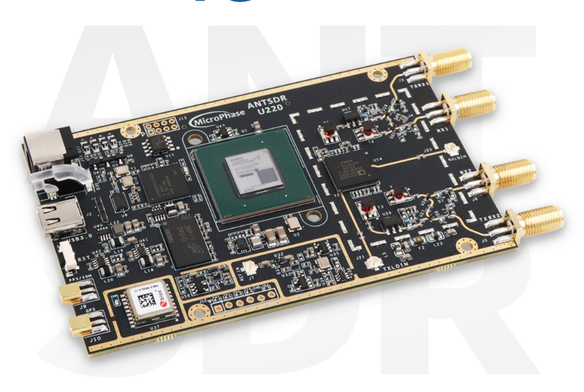
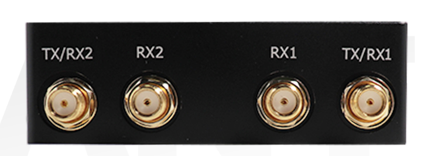
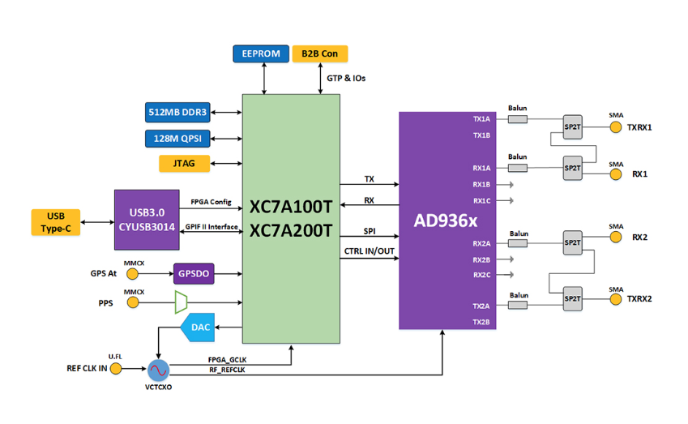

# 📡 ANTSDR U220: Integration & Prototyping Guides

 

*A comprehensive collection of tutorials, architecture breakdowns, Python/C++ scripts, and deployment guides for the MicroPhase ANTSDR U220.*

---

## 🎯 Objective

The goal of this repository is to bridge the gap between expensive enterprise lab equipment and accessible R&D hardware. By leveraging the U220's **AD9361 transceiver** and **Xilinx Artix-7 FPGA**, these guides demonstrate how to build robust, wideband RF pipelines that functionally match the capabilities of an Ettus USRP B210.

This repository serves as the companion documentation for my professional LinkedIn engineering series.

---

## ⚙️ Core Hardware & Interfaces

  
  &nbsp;
  
  
<i>Left: 2x2 MIMO TX/RX Chains. Right: USB 3.0 Pipeline and 10MHz/PPS Sync Ports.</i>

The documentation and scripts in this repository are built around the following high-performance specifications:

* **RF Transceiver:** Analog Devices AD9361 (70 MHz - 6 GHz)
* **MIMO Configuration:** 2x2 Full-Duplex (Independent TX/RX chains)
* **Host Interface:** USB 3.0 Type-C (5 Gbps pipeline for 56 MSPS streaming)
* **Synchronization:** Onboard GPS, 10MHz reference, and PPS inputs for absolute phase coherence

---

## 🏗️ System Architecture

To process **56 MHz of instantaneous bandwidth** without dropping samples, the U220 relies on a highly optimized signal path, offloading heavy digital signal processing from the host CPU to the FPGA.

  

* **RF Front-End:** The AD9361 handles analog-to-digital IQ conversion.
* **Digital Baseband:** The Xilinx Artix-7 (XC7A100T/200T) with 512MB DDR3 RAM executes hardware-level filtering, decimation, and custom modulation.
* **Host Controller:** The CYUSB3014 chip bridges the FPGA's GPIF II interface to the host PC via USB 3.0, ensuring a bottleneck-free pipeline.

---

## 🚀 Advanced Applications Covered

Throughout these guides, we will cover how to utilize this hardware architecture for:

1.  📡 **Counter-UAS (C-UAS):** Wideband spectrum monitoring and telemetry detection.
2.  📶 **Cellular Testbeds:** Private LTE/5G network prototyping using `srsRAN`.
3.  🛡️ **Electronic Warfare (EW):** Radar prototyping and reactive jamming architectures.
4.  ⚡ **Hardware Acceleration:** FPGA-level digital signal processing.

---

## 📊 Interactive Dashboard

Included in this repository is an **Interactive SPA Dashboard** (`ANTSDR_U220_Infographic.html` & `antsdr_interactive_overview.html`). 

To view it, simply clone this repository and open the HTML files in any standard web browser. It features interactive architecture breakdowns and `Chart.js` visualizations comparing legacy bandwidth bottlenecks against the U220's capabilities.

---

## 📂 Repository Structure

* 📁 **`Posts/`**: Contains the full text, formatting, and technical breakdowns of my SDR integration guides and tutorials.
* 📁 **`assets/`**: Contains the architecture diagrams, terminal screenshots, and high-resolution hardware photos referenced in the documentation.
* 📁 **`scripts/`**: Contains custom Python UHD automation scripts, ZeroMQ (ZMQ) integration pipelines, and DSP flowgraphs.

---

## 👨‍💻 About the Author

**Adnan Sami** *Hardware and Software Integration Engineer*

Specializing in SDR prototyping, FPGA design, and hardware/software integration for complex RF systems, including Counter-UAS and wideband spectrum analysis.

📫 *Feel free to fork this repository, open issues if you run into hardware bugs, or connect with me on [LinkedIn](#) to discuss RF engineering and system integration.*